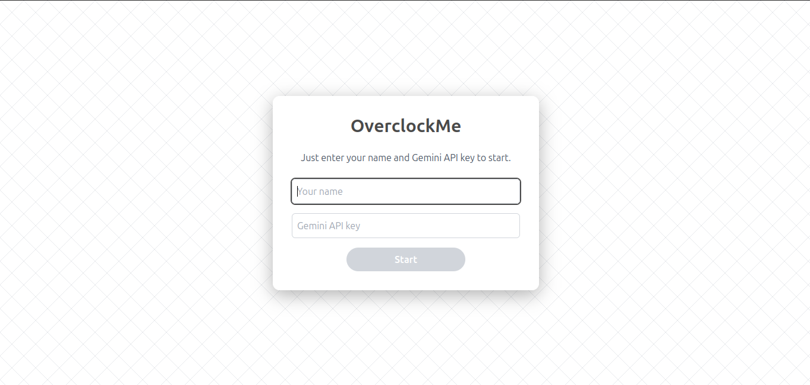
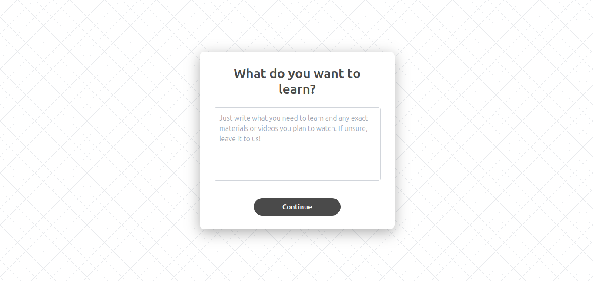
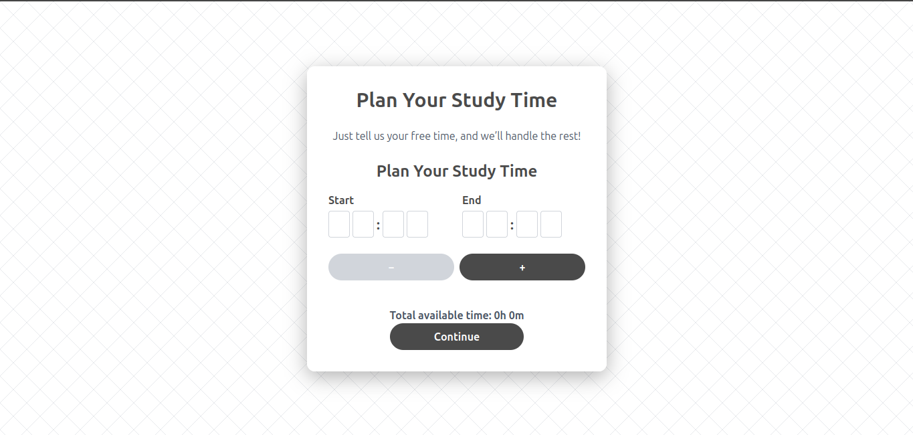
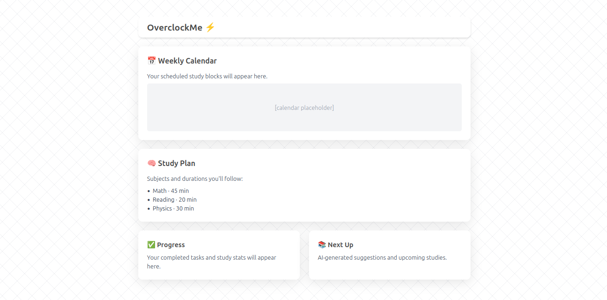

# OverclockMe ⚡

**OverclockMe** is an open-source, minimalist interface built with React, Vite, TailwindCSS, and Material UI.  
It’s designed to assist people with **limited study time** in organizing efficient, AI-enhanced learning routines — from planning to execution.

## 📌 Purpose

OverclockMe is made for people who:

- Have **tight or unpredictable schedules**
- Want to optimize their learning time
- Prefer clean, responsive, and distraction-free UIs
- Seek AI-driven assistance to stay consistent

## 🧠 Flow Preview

1. **Login** — with your name and Gemini API Key
2. **Goal Definition** — just type what you want to learn (topics, videos, goals, etc.)
3. **Time Setup** — add your available time slots
4. **Dashboard** — follow your personalized plan

> This flow will evolve with features like performance tracking, smart insights, and backend integration.

## 💡 Current Features

- 🎯 Focused, step-by-step UI
- 🧍 Auto-focus and input guidance
- ⛔ Field validation with clear feedback
- ⏳ Loading states with Material UI spinners
- 📱 Mobile-friendly and responsive layout
- 🔐 Gemini API key input (simulated for now)
- 📊 Dashboard with calendar, plan, and study progress cards

## 📸 UI Screenshots

#### 🔐 Login



#### 🧠 What You Want to Learn



#### 🕒 Time Setup



#### 📊 Dashboard



## 🛠️ Tech Stack

- [React](https://reactjs.org/)
- [Vite](https://vitejs.dev/)
- [Tailwind CSS](https://tailwindcss.com/)
- [Material UI](https://mui.com/)
- [Node.js](https://nodejs.org/) + NPM

## 🚀 Getting Started

```bash
# Clone the repo
git clone https://github.com/ricardorisson/overclockme.git

# Navigate into the project folder
cd overclockme

# Install dependencies
npm install

# Start the development server
npm run dev

    🔧 Note: The login currently simulates API usage. Backend and persistence features are under construction.

🌐 Contributing

This project is fully open-source and in active development.
Feel free to fork it, open issues, suggest features, or submit pull requests.
📜 License

Licensed under the MIT License.
See the LICENSE file for details.
✨ Try Gemini (Free)

Get your free Gemini API key here:
👉 https://ai.google.dev/gemini-api/docs
```
